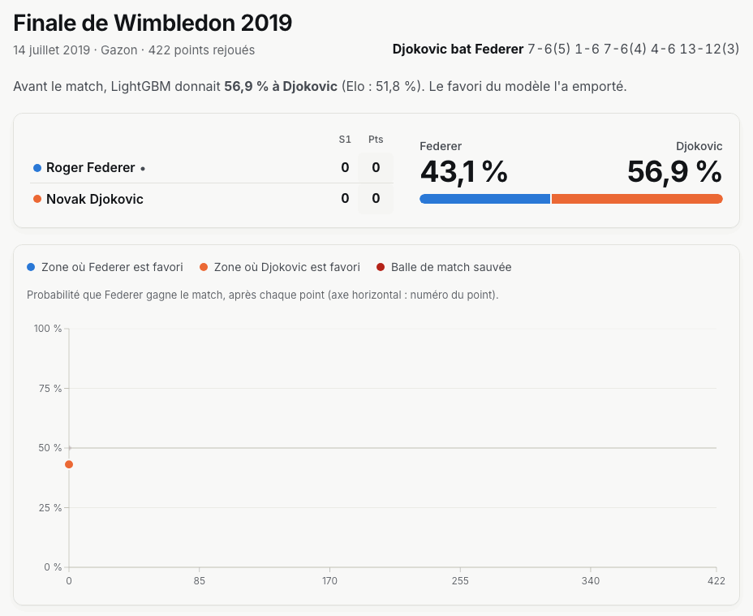

# MatchPoint

Prédiction de matchs de tennis ATP : un modèle LightGBM évalué sans filtre face à une baseline Elo par surface, et des finales mythiques rejouées point par point.

**Site en ligne : lien Vercel à renseigner après le premier déploiement (voir « Intégration et déploiement continus »).**



## Ce que fait le projet

Avant chaque match du circuit ATP, MatchPoint estime la probabilité de victoire de chaque joueur. Il compare ces prévisions à celles d'un classement Elo, la référence du domaine, sur des matchs que les modèles n'ont jamais vus, et affiche les deux résultats côte à côte. Le site permet aussi de revivre cinq finales de Grand Chelem point par point, en regardant la probabilité de victoire basculer à chaque échange.

## Méthodologie

### Données

- **Résultats ATP** : dépôt [`tennis_atp`](https://github.com/JeffSackmann/tennis_atp) de **Jeff Sackmann / Tennis Abstract**, soit 199 350 matchs du circuit principal (Grand Chelem, Masters 1000, ATP 250 et 500, Masters de fin d'année, Coupe Davis, Jeux olympiques) de 1968 au 7 juin 2026.
- **Replays** : [Match Charting Project](https://github.com/JeffSackmann/tennis_MatchChartingProject), du même auteur, où des bénévoles notent chaque point des matchs.

Les deux sources sont publiées sous licence [CC BY-NC-SA 4.0](https://creativecommons.org/licenses/by-nc-sa/4.0/deed.fr). Les fichiers JSON dérivés de `web/public/data` sont partagés sous la même licence.

> **Source disparue, contournement documenté.** En septembre 2026, le dépôt `JeffSackmann/tennis_atp` renvoie une erreur 404 ; seul le Match Charting Project reste en ligne. De nombreuses copies publiques contiennent en revanche le dernier commit publié par l'auteur (`712be0c5ade693cdab9e69c23a71a0edf5a23c44`, « thru 8 jun 2026 »). Le pipeline tente toujours le dépôt original en premier, puis télécharge les fichiers depuis une copie **épinglée sur ce commit** ([`pipeline/sources.py`](pipeline/sources.py)). Comme l'empreinte d'un commit Git dépend de tout son contenu, les fichiers sont identiques à l'original, quel que soit le miroir qui les sert. Si le dépôt original revient, le rafraîchissement hebdomadaire l'utilisera automatiquement.

Nettoyage (`python -m pipeline` écrit le résultat dans `data/processed/matches.csv.gz`, non versionné) :

| Colonne | Description |
| --- | --- |
| `match_key` | Identifiant unique `tourney_id-match_num` |
| `tourney_level` | `G` Grand Chelem, `M` Masters 1000, `A` ATP 250/500, `F` Masters de fin d'année, `D` Coupe Davis, `O` Jeux olympiques |
| `tourney_date` | Date de début du tournoi |
| `match_date` | Date estimée du match (début du tournoi + décalage selon le tour) |
| `surface` | `Hard`, `Clay` ou `Grass` (la moquette est rattachée au dur) |
| `round`, `round_order` | Tour et son rang chronologique dans le tableau |
| `best_of` | 3 ou 5 sets |
| `outcome` | `completed`, `retirement` (abandon, disqualification), `walkover` ou `unknown` |
| `winner_*`, `loser_*` | Identifiant, nom, main, taille, âge, classement et points ATP avant le match |
| `w_*`, `l_*` | Points au service, points gagnés sur première et seconde balle |

- 1 307 forfaits et 4 213 abandons ou disqualifications sont exclus du Elo, de l'apprentissage et de l'évaluation : ils ne reflètent pas un résultat sportif. Les abandons comptent toutefois comme matchs joués pour les variables de fatigue.
- Les lignes sans date, au format inconnu (`best_of` différent de 3 ou 5) ou opposant un joueur à lui-même sont supprimées ; tailles hors de 150–215 cm, âges hors de 14–50 ans et classements non positifs deviennent des valeurs manquantes.
- Le jeu est rejeté (et le pipeline s'arrête) si une date est incohérente, si l'ordre chronologique est rompu ou si un identifiant est dupliqué. Ces contrôles sont couverts par des tests unitaires.

### Découpage temporel

Aucune information postérieure à un match ne sert à le prédire. Le découpage est strictement chronologique (un tournoi appartient à la période de sa date de début) :

| Période | Dates | Matchs évalués | Usage |
| --- | --- | ---: | --- |
| Entraînement | 1991 – 2023 | 101 868 | apprentissage du modèle |
| Validation | 2024 | 3 050 | choix des hyperparamètres et de la calibration |
| Test | 6 janvier 2025 – 7 juin 2026 | 4 140 | verdict final, utilisé une seule fois |

Le Elo et toutes les variables sont calculés en un seul passage chronologique depuis 1968 : pour chaque match, seuls les matchs antérieurs comptent. Des tests vérifient que tronquer l'historique ou inverser les résultats futurs ne modifie aucune variable passée.

### Modèles comparés

**1. Elo par surface (baseline).** Chaque joueur a un Elo global et un Elo par surface, mis à jour match après match :

- probabilité de victoire : `P(A) = 1 / (1 + 10^((R_B − R_A) / 400))`
- mise à jour : `R' = R + K × (S − P)`, avec `K = 250 / (n + 5)^0,4` (n = matchs déjà joués)
- prévision : écart de la moyenne 50/50 entre Elo global et Elo de la surface

Les paramètres viennent de la littérature (FiveThirtyEight, Kovalchik 2016) et ne sont pas optimisés sur nos données, pour ne donner aucun avantage caché à la baseline ni au modèle.

**2. Elo recalibré.** Même classement, mais corrigé de son excès de confiance par une régression logistique ajustée sur la période d'entraînement. Il sert à séparer ce que le modèle avancé apporte en information de ce qu'il apporte en simple calibration.

**3. LightGBM.** Gradient boosting sur 50 variables connues avant le match :

| Famille | Variables |
| --- | --- |
| Elo | Elo global et surface des deux joueurs, écarts, combinaison 50/50 |
| Classement ATP | rang et points (rapports logarithmiques) |
| Forme récente | part de victoires sur 10 et 20 matchs, toutes surfaces et sur la surface du jour |
| Service et retour | part de points gagnés au service et au retour sur les 30 derniers matchs |
| Face-à-face | victoires de chacun, part lissée |
| Repos et fatigue | jours depuis le dernier match, matchs déjà joués dans le tournoi |
| Profil | âge, taille, main dominante, matchs joués en carrière et sur la surface |
| Contexte | surface, niveau du tournoi, tour, format 3 ou 5 sets, taille du tableau |

Chaque match est présenté deux fois à l'entraînement (du point de vue de chaque joueur) et la prévision moyenne les deux orientations, ce qui garantit `P(A bat B) + P(B bat A) = 1`. La recherche d'hyperparamètres est aléatoire (30 configurations) avec arrêt anticipé sur 2024 ; aucune validation croisée aléatoire n'est utilisée, car elle mélangerait passé et futur. La calibration (aucune, Platt ou isotonique) est choisie par validation croisée sur les deux moitiés de 2024 : la sortie brute, déjà bien calibrée, l'emporte.

### Replay point par point

1. La probabilité d'avant-match vient d'un **backtest annuel** : pour une finale de l'année N, le modèle est entraîné sur les saisons antérieures à N − 1 et arrêté sur N − 1. Aucune finale n'a été vue par le modèle qui la prédit.
2. Elle est convertie en probabilités de gagner un point sur son service, `μ + d` et `μ − d`, où μ est la moyenne du circuit sur la surface lors des trois saisons précédentes et d est résolu pour retrouver exactement la probabilité d'avant-match.
3. Une chaîne de Markov hiérarchique (point → jeu → tie-break → set → match) calcule la probabilité exacte de victoire depuis chaque score, en respectant la règle du set décisif de l'époque (avantage, tie-break à 12-12, super tie-break en 10 points). Le calcul exact est validé par simulation de Monte-Carlo dans les tests.

Chaque match est reconstitué point par point et confronté au relevé et au score officiel : au moindre écart, il est rejeté. Matchs disponibles : Wimbledon 2008, Open d'Australie 2012, Wimbledon 2019, Roland-Garros 2025 et Open d'Australie 2026.

## Résultats

Période de test : 4 140 matchs, du 6 janvier 2025 au 7 juin 2026.

| Modèle | Exactitude | Log loss | Brier | Erreur de calibration |
| --- | ---: | ---: | ---: | ---: |
| Elo par surface (baseline) | 64,8 % | 0,6342 | 0,2208 | 5,2 % |
| Elo recalibré | 64,8 % | 0,6244 | 0,2178 | 1,9 % |
| **LightGBM** | **66,4 %** | **0,6031** | **0,2089** | 2,2 % |

Écart LightGBM − Elo, avec intervalle de confiance à 95 % (bootstrap apparié, 2 000 tirages) :

| Métrique | Face au Elo | Face au Elo recalibré |
| --- | --- | --- |
| Exactitude | +1,6 pt [+0,5 ; +2,8] | +1,6 pt [+0,5 ; +2,8] |
| Log loss | −0,031 [−0,040 ; −0,022] | −0,021 [−0,029 ; −0,014] |
| Brier | −0,012 [−0,015 ; −0,008] | −0,009 [−0,012 ; −0,006] |

**Ce que ça signifie.** LightGBM bat la baseline de façon statistiquement significative sur les trois métriques, mais le gain reste modeste : 1,6 point d'exactitude, et un tiers des matchs restent mal prédits. Près d'un tiers du gain en log loss vient simplement d'une meilleure calibration (le Elo classique est trop sûr de lui) ; le reste est une information que le Elo seul ne capte pas. Sur le backtest annuel 2006–2026, LightGBM obtient une meilleure log loss que le Elo sur les 21 saisons. En revanche, il fait légèrement moins bien que le Elo en Masters 1000 (62,8 % contre 63,7 % d'exactitude sur 1 156 matchs).

## Limites connues

- **Joueurs peu connus du modèle** : seuls les matchs du circuit principal sont utilisés (pas les Challengers ni les qualifications), si bien qu'un joueur qui arrive sur le circuit démarre sans historique. Sur la période de test, l'écart reste faible (66,0 % d'exactitude quand l'un des joueurs a moins de 30 matchs en base, 66,6 % sinon), mais ces prévisions reposent sur peu d'information.
- **Blessures et contexte invisibles** : blessure en cours, maladie, motivation, météo, altitude, type de balle, salle ou extérieur ne sont pas dans les données.
- **Exclusion des abandons** : on ne sait pas avant un match qu'il finira sur abandon ; les retirer de l'évaluation rend les scores légèrement optimistes, pour tous les modèles.
- **Dates approximatives** : la base ne donne que la date de début du tournoi ; la date de chaque match est estimée selon le tour.
- **Catégories fusionnées** : ATP 250 et 500 ne sont pas distingués, la moquette est rattachée au dur.
- **Replay sans dynamique** : la chaîne de Markov suppose des points indépendants et des forces au service constantes ; la courbe suit le tableau d'affichage, pas l'élan ou la fatigue du jour.
- **Données figées** : tant que le dépôt original reste indisponible, les résultats s'arrêtent au 7 juin 2026.

## Stack technique

- **Pipeline** : Python 3.12+, pandas, NumPy, scikit-learn, LightGBM ; ruff, mypy en mode strict, pytest (110 tests).
- **Site** : Next.js 16 en export statique (React 19, TypeScript strict), Recharts, CSS Modules, police Inter ; thèmes clair et sombre.
- **Qualité** : ESLint, Prettier, audit Lighthouse automatisé (accessibilité ≥ 95 exigée, 100 obtenu sur les quatre pages, mobile et ordinateur).
- **Hébergement** : Vercel (fichiers statiques, aucun serveur à réveiller) et GitHub Actions pour l'intégration continue et le rafraîchissement des données.

## Lancer le projet en local

Prérequis : Python 3.12 ou plus récent, Node.js 20.9 ou plus récent. Sur macOS, LightGBM a besoin d'OpenMP (`brew install libomp`).

```bash
git clone https://github.com/ligsow6/MatchPointAI.git
cd MatchPointAI

python3 -m venv .venv
source .venv/bin/activate
pip install -e ".[dev]"
pytest
python -m pipeline

cd web
npm ci
npm run dev
```

`python -m pipeline` télécharge les données (environ 170 Mo, mises en cache dans `data/raw`), recalcule Elo, variables, modèles et backtests (environ 5 minutes), puis régénère les fichiers JSON de `web/public/data`. Le site fonctionne aussi sans cette étape, avec les données déjà versionnées. `npm run build` produit le site statique dans `web/out`, que `npm run start` sert localement.

## Structure du dépôt

```
pipeline/            ingestion, nettoyage, Elo, variables, modèle, backtest, replay, export JSON
  tests/             tests unitaires (fuite temporelle, formules, Markov, exports)
web/                 site Next.js
  app/               pages : accueil, performance, rejouer, méthodologie
  components/        graphiques, replay, mise en page
  public/data/       fichiers JSON produits par le pipeline
.github/workflows/   ci.yml (qualité et accessibilité), refresh-data.yml (données)
docs/                capture du replay
```

## Intégration et déploiement continus

- **`ci.yml`** (à chaque push et pull request) : ruff, mypy et pytest pour le pipeline ; ESLint, TypeScript, Prettier et build pour le site ; audit Lighthouse de toutes les pages en mobile et en ordinateur, qui échoue sous 95 en accessibilité.
- **`refresh-data.yml`** (chaque lundi, et à chaque modification du pipeline) : télécharge les dernières données, relance tout le pipeline et commit les JSON (`chore: met à jour les données ATP`) uniquement s'ils ont changé. Ce commit déclenche un nouveau déploiement.
- **Vercel** : le fichier [`vercel.json`](vercel.json) décrit la construction du site statique ; chaque push sur `main` est déployé automatiquement.
